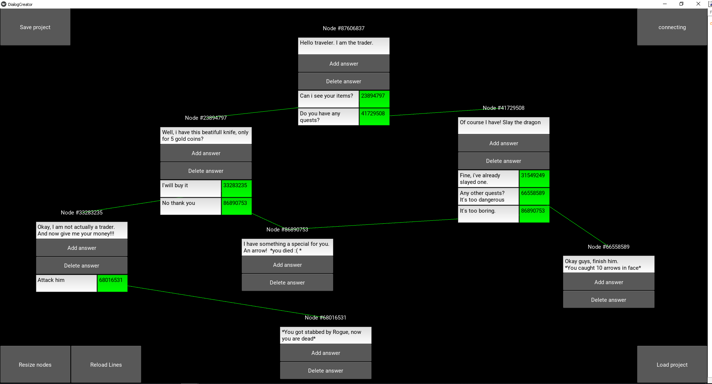
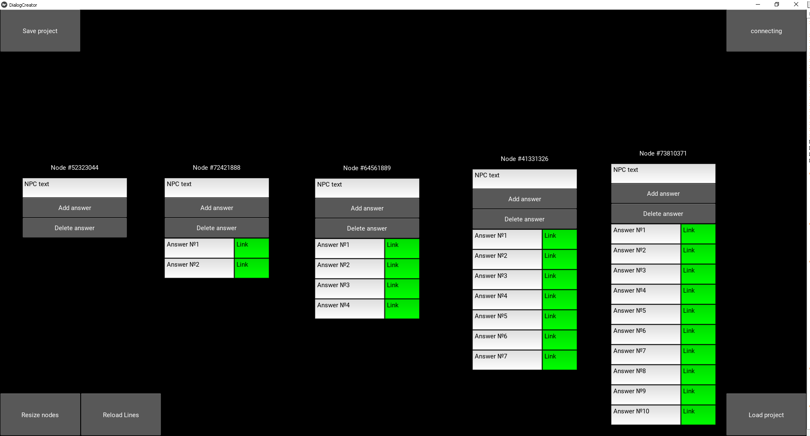
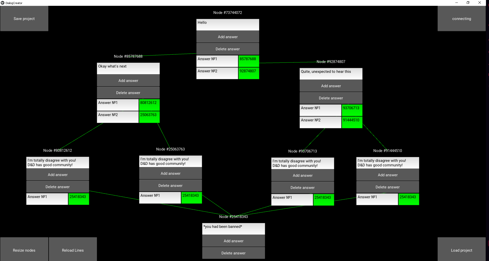

# DialogueCreator
Application for writing dialogues for video games. I wrote this like a free analogue of Dialogue Plugin for Unreal Engine 4 (80\$), but this application can be used in any project, cause it import all of the dialogues in simple JSON format.

Some technical details:
Each node has an unique id for finding it, NPC text, and list of answers(text/link). Link is number of nodew hich will be next if this answer is chosen. You can just open your json file and see simply structure of nodes.

Using connection mode you can connect nodes, click on green part of answer and after that click on node to what you want connect that answer


Shortcuts:

A add new node

S save current project


Shift - change mode

Screenshots:

1) example of project


2)adding more answers


3)example of json format for this project [file](DialogueCreator/projects/presentation.json)


Requirements:

1) Python 3.6 or above
2) Kivy 

Install essential packages using
```
pip install -r requirements.txt
```


If you have any questions or propositions, please write me via Telegram @Dushess0. I will help you if you want to use it in your applications.
Thanks You!

